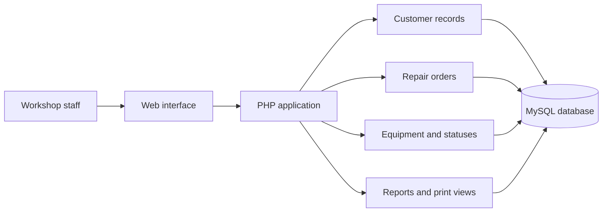

  

<h1 align="center">PCSpeedAPP</h1>

  Academic project showcase · Management Informatics · 2023

> [!IMPORTANT]
> This repository is a portfolio presentation of an old academic project. It does not contain the complete application source code, production data, credentials, or private company material.

## Overview

PCSpeedAPP was a web application for managing computer-repair and technical-support workflows. It was developed in 2023 as my **PAP (Prova de Aptidão Profissional / Professional Aptitude Project)** for a vocational course in **Management Informatics**.

The project was created in the context of **PCSpeed**, an IT services company based in **Viseu, Portugal**. Its purpose was to centralize customer information, equipment records, repair orders, workflow statuses, technical notes, and printable service documentation.

The application was functional in the environment for which it was developed. This repository now exists to document the project, the problems it addressed, and the technical experience gained from delivering it.

## Project Context

The academic project used **PGOSTEC**, an existing internal application developed by **Dário**, as a technical foundation supplied for educational support. PCSpeedAPP was produced by studying and adapting that foundation to the requirements of the PAP and the company's repair workflow.

My work involved understanding an existing codebase, adapting business processes, reorganizing and extending workflows, changing interface elements, creating or reworking application screens, working with the database, testing the resulting system, and presenting the final academic project.

I do not claim authorship of PGOSTEC or of the complete historical codebase. See [`PROVENANCE.md`](PROVENANCE.md) for the publication boundary.

## Main Capabilities

- Customer registration and customer records.
- Equipment, brand, accessory, and repair-status management.
- Creation and tracking of repair and service orders.
- Recording reported problems and technical work.
- Status-based workshop workflow.
- Printable repair documents and barcode labels.
- Operational reports and database backup tools.
- Proof-of-concept SMS integration.

## Technologies Used

- PHP
- MySQL / MariaDB
- HTML and CSS
- JavaScript
- Bootstrap
- Composer packages and a Vonage integration proof of concept

## Conceptual Architecture

More detail is available in [`docs/ARCHITECTURE.md`](docs/ARCHITECTURE.md).

## What This Repository Contains

- A factual description of the academic project.
- The transparent PCSpeedAPP project logo used in its presentation.
- A high-level architecture and workflow description.
- Space for fully anonymized screenshots.
- A documented process for reviewing possible portfolio code samples.

## What Is Not Published

- The original PGOSTEC source code.
- The complete historical PCSpeedAPP source tree.
- Database exports, backups, logs, or credentials.
- Real customer, employee, or company operational data.
- Internal notes, the school report, or supplied third-party material.

## Source-Code Availability

The complete source code is not publicly available because the academic project was built upon pre-existing proprietary software supplied for educational purposes. The absence of the source is intentional and protects third-party authorship, company information, and personal data.

The historical project is retained separately in the private repository [`daffwt221/PCSpeed`](https://github.com/daffwt221/PCSpeed). This link is included only to document that the archived project exists; it does not provide or imply public access. GitHub may display a `404` page to visitors who do not have permission to view a private repository.

The included code samples were created specifically for this 2026 portfolio review. They are not the code submitted in 2023 and do not reconstruct private implementation details. The publication criteria are documented in [`samples/README.md`](samples/README.md).

## Selected Code Samples

To demonstrate the relevant engineering concepts without exposing the historical application, this repository includes a small set of **clean 2026 portfolio examples**:

| Sample | What it demonstrates |
| --- | --- |
| [`CustomerRepository.php`](samples/CustomerRepository.php) | Typed PHP, PDO prepared statements, and focused data access |
| [`RepairOrderWorkflow.php`](samples/RepairOrderWorkflow.php) | Explicit repair statuses and validated state transitions |
| [`CsrfGuard.php`](samples/CsrfGuard.php) | Random session tokens and timing-safe CSRF verification |
| [`schema.sql`](samples/schema.sql) | A simplified relational design with constraints and indexes |

These files are not presented as work submitted during the original 2023 PAP. They illustrate how selected concepts from the project can be implemented cleanly today. See [`samples/README.md`](samples/README.md) for the exact boundary.

## Security and Maintenance

This was a learning project created in 2023 and is no longer maintained. The historical application should not be deployed or treated as production-ready software. It may contain outdated dependencies and insecure patterns typical of an early academic project.

No real data should ever be added to this public showcase. Screenshots must be fully anonymized before publication; see [`docs/SCREENSHOTS.md`](docs/SCREENSHOTS.md).

## Skills Demonstrated

- Reading and adapting an existing PHP codebase.
- Translating business requirements into application workflows.
- Relational database work with MySQL.
- CRUD interfaces and server-side form processing.
- Repair-order lifecycle and status modelling.
- Reporting, printing, testing, and academic project delivery.
- Recognizing the importance of security, privacy, licensing, and source provenance.

## Retrospective

The project and the decisions I would make differently today are discussed in [`docs/RETROSPECTIVE.md`](docs/RETROSPECTIVE.md).

## Status

This repository is a historical portfolio showcase, not an active product. PCSpeed and PGOSTEC are referenced only to explain the factual context of the 2023 project; no endorsement or current affiliation is implied.
